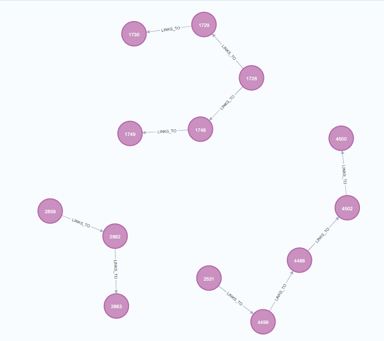

"# etl_neo4j" 

## Architecture

## Find Relationship By Unique ID

You can use these queries to find nodes based on their unique_id. If you want to find multiple paths, simply add a UNION after the RETURN statement and include additional queries to define the desired paths.

"MATCH (n:Node {unique_id: "TRANS_MB51DS_R_202407230000412531"})
CALL apoc.path.subgraphAll(n, {
    relationshipFilter: 'LINKS_TO>',
    labelFilter: "+Node",
    limit: 5
})
YIELD nodes, relationships
RETURN nodes as path, relationships"

# INSTALL NEO4J FROM DOCKER
https://docs.dbagenesis.com/post/install-neo4j-on-docker

